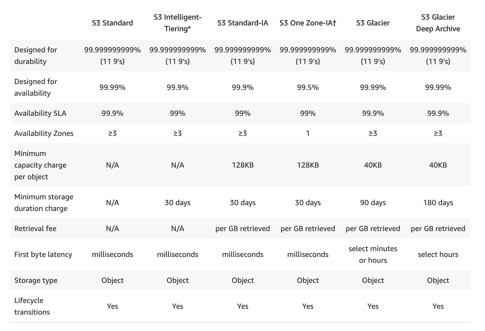
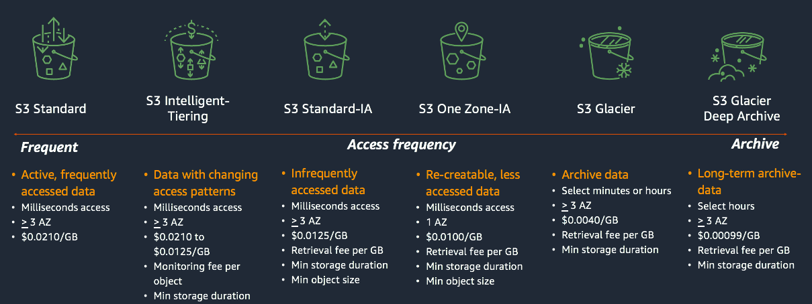

# 1. S3 - Amazon Simple Storage Service

- S3 là 1 dịch vụ lưu trữ của AWS
- S3 là Object-based storage
- Not suitable to install an OS
- File có thể có kích thước từ 0 -> 5TB
- Không giới hạn dung lượng lưu trữ trong bucket
- Mặc định có thể tạo 100 bucket. Có thể tạo nhiều hơn lên tới 1,000 bằng việc tạo liên hệ với Support Center

- S3 Bucket có tên là duy nhất đối với toàn bộ hệ thống AWS
- Khi upload 1 file lên S3, bạn sẽ nhận dc mã HTTP 200 OK nếu upload thành công

- Object có thể coi giống như file, bao gồm các thông tin

    - Key: Tên Object
    - Value: Chuỗi byte tạo lên file
    - VersionID (nếu như bật Version control của S3)
    - Metadata (Dữ liệu thông tin bổ sung cho object)

**Tính nhất quán của S3**

- Sau khi PUT 1 object mới, ta có thể đọc object ngay lập tức
- Khi cập nhật hoặc xóa 1 cũ đang tồn tại, khi đọc ta vẫn có thể gặp trường hợp là thông tin của object cũ. Nguyên nhân là nó có thể đang trong quá trình replication giữa các AZ (Eventual consistency).

- S3 đảm bảo 99.999999999 (11x9s) tính bền vững của dữ liệu

**S3 có những tính năng sau**

- Phân loại lữu trữ 
- Lifecycle management
- Versioning
- Encryption
- MFA Delete - multi factor delete
- Secure data using ACL and Bucket Policies

**Các phân loại lưu trữ của S3**

**Bạn sẽ phải trả tiền sử dụng S3 dựa vào**

- Storage
- Requests
- Storage management pricing
- Data transfer pricing
- Transfer acceleration
- Cross region replication pricing

---

- Amazon S3 Transfer Acceleration enables fast, easy and secure trasnfers of files over long distances between your and users and S3 bucket

- Transfer Acceleration take advantage of Amazon CloudFront's globally distributed edge locations/ As the data arrive at an edge location, data is routed to S3 over and optimized network path.

---

**Security and Ecryption**

- By default, all newly created buckets are PRIVATE. You can setup access control to your buckets using:
    
    - Bucket policies
    - Access control list ACL

- S3 bucket can be configured  to create access logs which log all requests made to the S3 bucket. This can be sent to another bucket and even another bucket in another account

- Encryption in Transit is achieved by 

    - SSL/TLS
- Encryption at REST(Server Side) is achieved by
    
    - S3 Managed Keys - SSE - S3
    - AWS Key Management Service, Managed Keys - SSE-KMS
    - Server Side Encryption with Customer Provided Keys - SSE - C
- Client side encyption

----

**Đọc thêm FAQ về S3**

https://aws.amazon.com/vi/s3/faqs/

